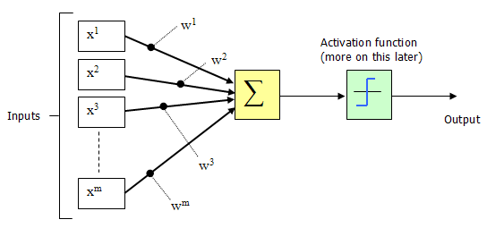
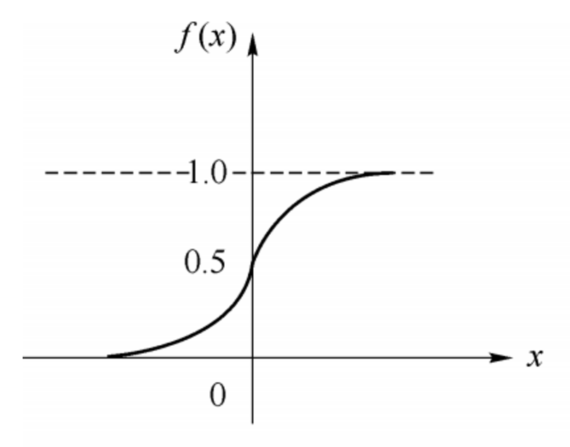

# 神经网络
## 一、感知器
感知器接受多个输入，产生一个输出


**例子：看展览**

    天气
    
    同伴      -------------> 是否去看展览
    
    门票价格

**权重**

现实中，各种因素很少具有同等重要性：某些因素是决定性因素，另一些因素是次要因素。因此，可以给这些因素指定权重（weight），代表它们不同的重要性。

若设定
```python
    天气：权重为8
    同伴：权重为4
    价格：权重为4
```
则上面的权重表示，天气是决定性因素，同伴和价格都是次要因素。

如果三个因素都为1，它们乘以权重的总和就是 8 + 4 + 4 = 16。如果天气和价格因素为1，同伴因素为0，总和就变为 8 + 0 + 4 = 12。

**阈值**

如果总和大于阈值，感知器输出1，否则输出0。假定阈值为8，那么 12 > 8，去参观。阈值的高低代表了意愿的强烈，阈值越低就表示越想去，越高就越不想去。计算公式如下
    


## 二、神经网络
### 1. 条件
```python
    输入和输出  # 神经网络的输入和输出
    权重（w）和阈值（b） # 神经网络的参数
    多层感知器的结构    # 神经网络的结构
```

### 2. 神经网络结构，训练过程解释


**模型的训练过程：**

首先主观给出一个权重w和阈值b，然后根据算法对w或者b做出微小的变动，观察输出值(损失函数的变化)的变化，根据这个变化对w和b做出调整。直到最优为止。(训练的过程)

+ 确定输入和输出
+ 找到一种或多种算法，可以从输入得到输出
+ 找到一组已知答案的数据集，用来训练模型，估算w和b
+ 一旦新的数据产生，输入模型，就可以得到结果，同时对w和b进行校正


一个神经元的输入与输出



公式： y=f(∑ni=1wixi−θ)    其中，θ为神经元的激活阈值，函数f(⋅)也被称为是激活函数

函数f(⋅)可以用一个阶跃方程表示，大于阈值激活；否则则抑制。因为阶跃函数不光滑，不连续，不可导，因此我们更常用的方法是用sigmoid函数来表示函数函数f(⋅) :

$$
sigmoid(x)= \cfrac{1}{1+e^{-x}}
$$
图像为：




